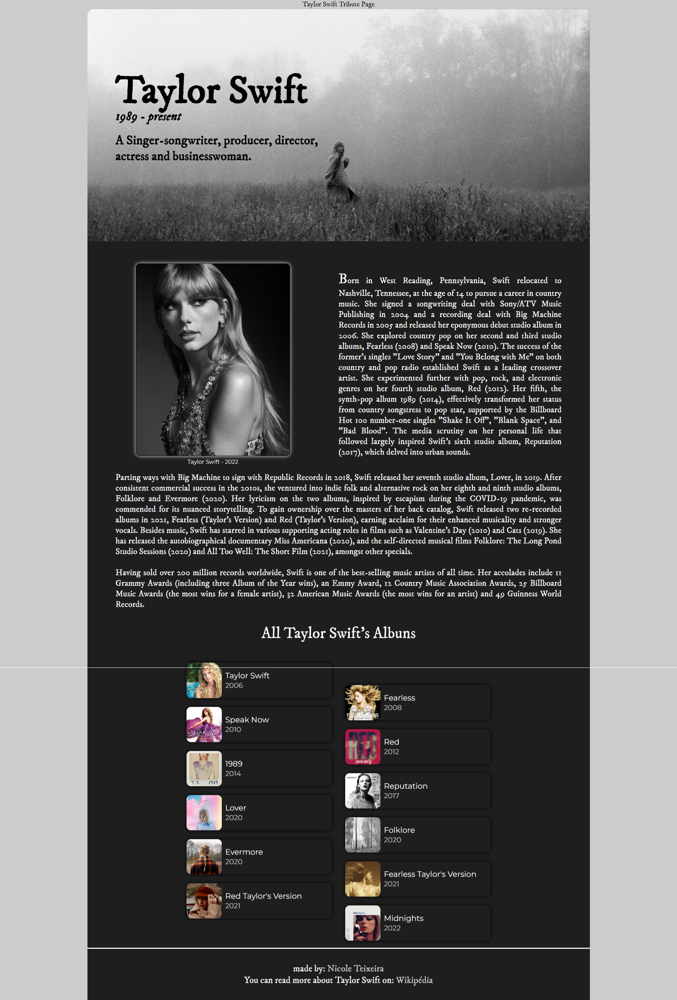

# Tribute Page :page_facing_up:

a Taylor Swift tribute page made for improve some HTML and CSS skills. I started this project in the middle of a course about this technologies and in the responsiveness part became too dificult in that time.

So now that I finish the course, I started all over again.

---

Javascript is only used in a button avaliable only in the desktop layout

- The button brings the user to the top of page

## On desktop :computer:

## Mobile :iphone:

